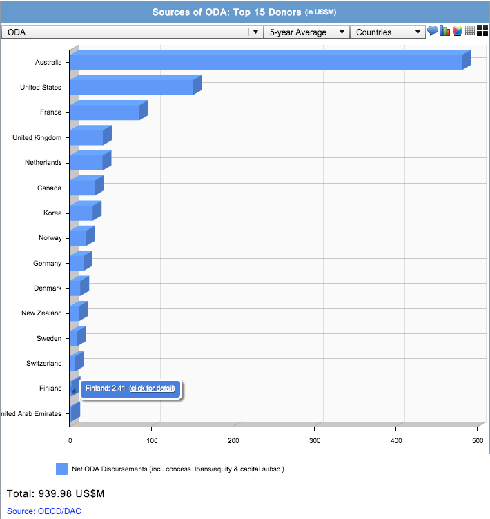

README 

A short slidedeck prepared for a workshop in Jakarta in September 2014, looking at different types of data visualisations. Examples are taken from various aid data websites, looking specifically at how data around Official Development Assistance in Indonesia can be visualised. 

Slides are forked from [Michael's presentation for School of Data](https://github.com/school-of-data/Introduction-to-dataviz) and slides for that area based on these [html5slides](https://code.google.com/p/html5slides/).

## Instructions for customising the slides 

First, fork this presentation into your own repository. Instructions on how to do this are [here](https://help.github.com/articles/fork-a-repo/).

General tips: 

* The text in some of the 'question' slides will need to be replaced: eg. How can we visualise Official Development Assistance (ODA) to [COUNTRY NAME]?

* When you come across an image you want to include, if it doesn't have an embed code generated automatically, take a screenshot and upload it to the [Images folder](https://github.com/zararah/Introduction-to-dataviz/tree/gh-pages/images), making sure that none of the image file names have spaces in them (use - or _ to separate words if you like.)
In the slides, the images are called using: 

	

So, replace what comes after the first / with the name of your image, and adjust the percentage of width accordingly. 

* Rename what is now 'logo.png' in the images folder (eg. logo-old.png) then upload a version of the logo that you want to appear on every slide as 'logo.png' in the Images folder, to replace the logo there throughout the slidedeck. 

* The text for the slides all goes into the [index.html](https://github.com/zararah/Introduction-to-dataviz/blob/gh-pages/index.html) file. Each slide is separated with <article> [TEXT AND IMAGES FOR ARTICLE] </article>. 

* Images will also need to be replaced. Here is a list of the image sources and where you can generate relevant ones for the country in question: 

**Slide 8** This is generated from [OpenSpending] - type [country name] + budget into the search box on the OpenSpending homepage, then copy over the embed code to the slide. 

**Slide 9** As this is a global visualisation, it doesn't need to be customised/updated - it comes from this [Compare your Country](http://www.compareyourcountry.org/aid-statistics?cr=625&lg=en&page=1) tool.

**Slide 11** This is generated from [d-portal](https://d-portal.org/): go to the country profile, and simply take a screenshot of a visualisation there - or, find the embed code for another visualisation there that you'd like to explain.

**Slide 12** This is a screenshot of a visualisation generated through the [AidFlows](http://www.aidflows.org/) site: select the country on the left, then select 'Beneficiary View' from the tabs at the top, then 'Sources and Uses of ODA' on the top sub-menu. There might also be other more relevant or interesting visualisations there with respect to the country you're looking into, so have a look around first.

**Slide 13** This is generated from the 'Recipient view' of the [Compare your Country](http://www.compareyourcountry.org/aid-statistics?cr=738&cr1=oecd&lg=en&page=1) tool we mentioned earlier. Select your country, then expand the view and select 'share/embed' from the buttons at the bottom of the page. Copy this code into the relevant slide.

**Slide 15** This is another one from [AidFlows](http://www.aidflows.org/): select the country on the left, then 'Beneficiary View' again, and then the tab 'ODA as % of GNI' to find this version of the visualisation. Again, screenshot, save it into the Images folder, and 

**Slide 16** This is made through Development Initiatives' tool, [The changing picture of international flows by country](http://devinit.org/data-visualization/datavisualization-all-resources/). Adjust the country by selecting 'location' on the left sidebar, then click on the little 'Explore Data' option that comes up in the bottom right hand corner. Then, you'll be taken to a screen where you can get the embed code by clicking on the chain icon in the top right hand corner; copy this into the slide.

**Slide 18** This is another [OpenSpending](http://openspending.org) visualisation - it might not be available for the country you're looking into, but it was generated by clicking on the section that represents foreign aid in the overall national budget; this is the breakdown of that section. 

**Slide 19** Here, AusAID was chosen because they are one of the biggest donors to Indonesia; look for the biggest donor to the country you're looking into, and see if there are any visualisations on their site, to replace this image. 

## Tips for presenting the slides

The visualisations included here are primarily to provoke reactions; they are definitely not an endorsement! 

A few good questions to think about (and ask the audience) while you're going through these slides is: 

* What is the visualisation trying to show? (If nobody can answer, it is usually a good indicator that the visualisation isn't very good)

* If you had to summarise this visualisation in one sentence, what would it be?

* What could be improved about this visualisation? (eg. not having crossing lines on a pie chart, or bigger labelling of key points, or simply using a different visualisation method)